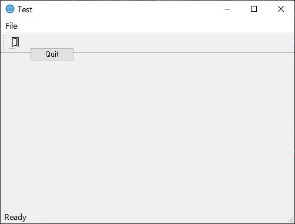

# 기본

## 0. 설치

  - [PyQt5 설치안내](http://pyqt.sourceforge.net/Docs/PyQt5/installation.html)

```
    pip3 install PyQt5
```

  - VSCode 를 사용할 시에 python의 경우 pylint 를 별도로 설치해야 한다.
  - [pylint 설치 안내](https://www.pylint.org/#install)

```
    pip install pylint
```
  - VSCode 에서 python 작성해야 하는 경우
    - 본인 컴퓨터에 [python을 설치](https://www.python.org/downloads/)
    - VSCode에서 Python 이라는 Extension을 설치 ([Python - Microsoft](https://marketplace.visualstudio.com/items?itemName=ms-python.python))

## 1. 기본 코드

  - 기본 코드 ([출처](https://wikidocs.net/21923))

```python
  '''
  basic PyQt5
  '''

  import sys
  from PyQt5.QtWidgets import QApplication, QPushButton, QMainWindow, QAction, qApp, QToolTip
  from PyQt5.QtWidgets import QDesktopWidget
  from PyQt5.QtGui import QIcon, QFont
  from PyQt5.QtCore import QCoreApplication

  class MyApp(QMainWindow):
      '''
      MyApp Class
      '''
      def __init__(self):
          super().__init__()
          self.init_ui()

      def init_ui(self):
          '''
          Set initial ui
          '''

          # exitAction
          exit_action = QAction(QIcon('exit.png'), 'Exit', self)
          exit_action.setShortcut('ctrl+Q')
          exit_action.setStatusTip('Exit application')
          exit_action.triggered.connect(qApp.quit)

          # 메뉴바 생성
          self.statusBar()

          # 툴바 생성
          self.toolbar = self.addToolBar('Exit')
          self.toolbar.addAction(exit_action)

          menu_bar = self.menuBar()
          menu_bar.setNativeMenuBar(False)
          file_menu = menu_bar.addMenu('&File')
          file_menu.addAction(exit_action)

          # 상태바 설정
          self.statusBar().showMessage('Ready')

          # ToolTip 설정
          QToolTip.setFont(QFont('SansSerif', 10))
          self.setToolTip('This is a <b>QWidget</b> widget')

          # 버튼 생성
          btn = QPushButton('Quit', self)
          self.setToolTip('This is a <b>QPushButton</b> widget')
          btn.move(50, 50)
          btn.resize(btn.sizeHint())
          btn.clicked.connect(QCoreApplication.instance().quit)

          # 창 제목
          self.setWindowTitle('Test')

          # 창 제목 옆 아이콘
          self.setWindowIcon(QIcon('web.png'))

          # 창 크기 설정
          self.resize(500, 350)
          # center가 없었을때, 300 x 300 크기에 (300, 200) 위치에 표시하라는 의미
          # self.setGeometry(300, 300, 300, 200)
          self.center()
          self.show()

      # 창을 가운데로!
      def center(self):
          '''
          make window move center
          '''
          qr_values = self.frameGeometry()
          cp_values = QDesktopWidget().availableGeometry().center()
          qr_values.moveCenter(cp_values)
          self.move(qr_values.topLeft())


  if __name__ == '__main__':

      APP = QApplication(sys.argv)
      ex = MyApp()
      sys.exit(APP.exec_())

```

## 2. 결과



## 3. 참고자료

  - 
  - 
  - [QtWidgets 공식 문서](http://pyqt.sourceforge.net/Docs/PyQt5/QtWidgets.html#PyQt5-QtWidgets)
  - [QApplication 공식 문서](https://doc.qt.io/qt-5/qapplication.html)
  - [QPushButton 공식 문서](https://doc.qt.io/qt-5/qpushbutton.html)
  - [QToolTip 공식 문서](http://doc.qt.io/qt-5/qtooltip.html)
  - [QMainWindow 공식 문서](https://doc.qt.io/qt-5/qmainwindow.html)
  - [QStatusBar 공식 문서](https://doc.qt.io/qt-5/qstatusbar.html)
  - [QMenuBar 공식 문서](https://doc.qt.io/qt-5/qmenubar.html)
  - [QToolBar 공식 문서](https://doc.qt.io/qt-5/qtoolbar.html)

## 4. ERROR
  - [pylint 가 "missing module docstring" 라는 오류를 나타낸 경우](http://meonggae.blogspot.com/2017/03/git-pylint-pep8.html)
  - ["pylint can't find QWidget and QApplication" 에러가 발생한 경우](https://stackoverflow.com/questions/46337716/pylint-cant-find-qwidget-and-qapplication)
    - 같은 폴더에 다음 코드를 .pylintrc 파일을 생성해서 입력 후 저장

```
  [MASTER]
  extension-pkg-whitelist=PyQt5
```
